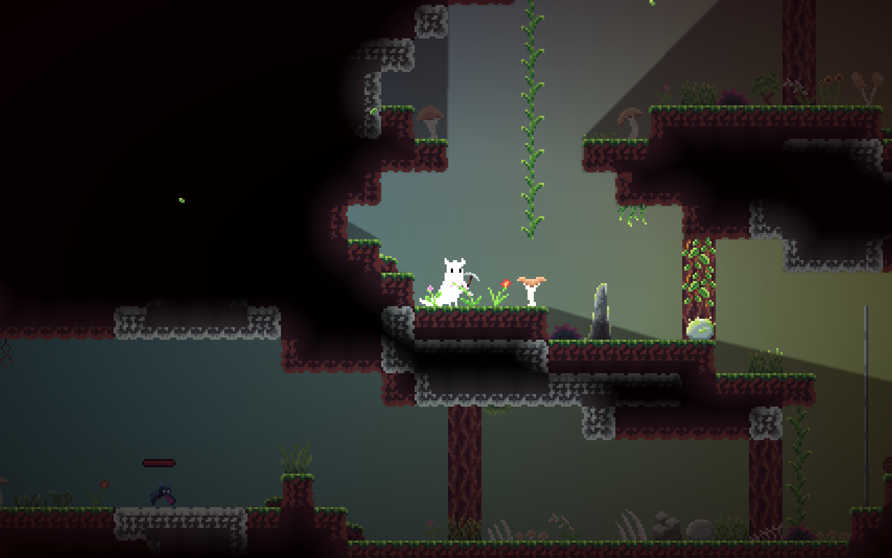

# Leafy Hollows

Survive, explore, and conquer the procedurally generated tunnels of Leafy Hollows - danger and adventure await.



---

## Overview

Leafy Hollows is a **pixel-art adventure game** set in a procedurally generated underground world.  
The player begins by falling into a deep pit and must escape through a vast tunnel system filled with hidden treasures, structures, rare loot, and parkour challenges.

But beware! Monsters of increasing difficulty roam the tunnels - goblins, bats, and a variety of slimes.  
Dodge their attacks and defeat them using your weapons: stick, sword, axe, pickaxe, bow, or a secret weapon waiting to be discovered.

Each weapon has two attributes and can be fused with another weapon to create stronger, more versatile tools.  
Experiment with combinations to gain an advantage against tougher enemies and survive the hollows.

## About

Leafy Hollows started as a school project and was developed over six months.  
It's a passion project that explores procedural generation, combat and movement mechanics, and parkour in a pixel-art underground world under the possibilities and limits of Python.

---

## Requirements

- Python 3.9+
- Install dependencies:
    ```sh
    pip install -r requirements.txt
    ```

## Running the Game

```sh
python3 src/main.py
```

## Controls

- Left Mouse: Attack
- Move with A and D
- Jump/Climb with Space
- Sprint with Shift
- Crawl with C
- Crouch-Jump with C+Space
- Open Inventory with E
- Open Menu with Escape

## License

- **Source code**: MIT License (see `LICENSE`)
- **Images** (`/data/images`): Proprietary – All rights reserved
- **Sounds** (`/data/sounds`): Mixed sources. See `credit.txt` in each folder for details and licenses
- **Font** (`/data/fonts/RobotoMono-Bold.ttf`): Apache License 2.0

For full details, see `LICENSE` and `ASSETS_LICENSE.md`.
